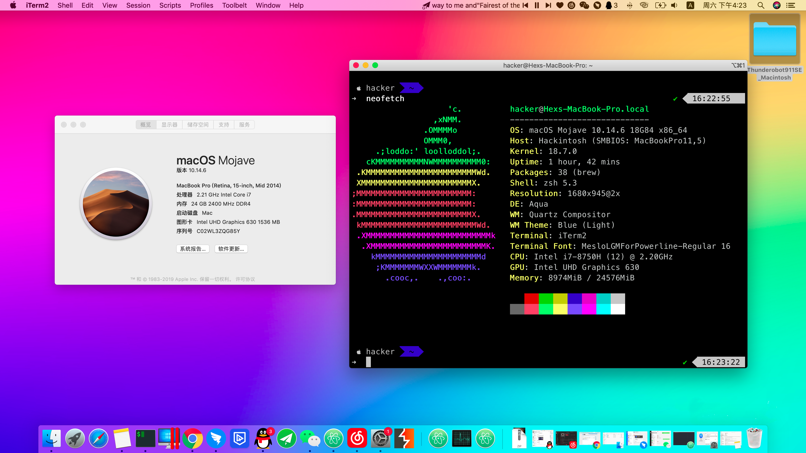

# 雷神911se黑苹果EFI文件

### 此项目后续不会更新了，自己在不久前已经入手了`Macbook Pro`，后续如果大佬一样买到了，雷神911se这款机子，有什么驱动问题，可以到远景黑苹果论坛一起talk，ID一样都是HexChristmas
### 一些写给后者研究的话
当我写下这段话的时候，真是思索了好一阵，自己折腾黑苹果可能已经4年了，从上学到实习到工作，在折腾某个驱动上可能花费了无数个深夜，浪费了很多时间，做了很多无用到事，有些遗憾，如果重来一次一定选择把更多到时间在技术到研究上，但没有如果，并不想给后来人什么建议，只是希望权衡研究黑苹果的利弊，在选择出发
## 结构
```
Mojave10.14_EFI
├── APPLE
│   ├── EXTENSIONS
│   └── FIRMWARE
├── BOOT
│   └── BOOTX64.efi
├── CLOVER
│   ├── ACPI
│   ├── CLOVERX64.efi
│   ├── config.plist
│   ├── drivers
│   ├── kexts
│   ├── themes
│   └── tools
└── grub
    └── grubx64.efi

11 directories, 4 files

Catalina10.15_EFI
├── BOOT
│   └── BOOTX64.efi
├── CLOVER
│   ├── ACPI
│   ├── CLOVERX64.efi
│   ├── config.plist
│   ├── doc
│   ├── drivers64UEFI
│   ├── kexts
│   ├── misc
│   ├── OEM
│   ├── ROM
│   ├── themes
│   └── tools
└── grub
    └── grubx64.efi

12 directories, 4 files

```
## 各驱动完善情况
驱动名称|完善程度
-|-
集显(uhd630)|成功驱动
声卡(ALC269)|成功驱动
无线(BCM94352z)|成功驱动
蓝牙(BCM94352z)|成功驱动
电源|成功驱动
键盘|成功驱动
触摸板|成功驱动
睿频|成功睿频
HIDPI|成功
独显|未成功
睡眠|未成功
HDMI|未成功

> 说明一下，键盘成功驱动但键位不对，懒得折腾了直接用Karabiner-Elements软件来填补缺点，大家可以试一下。没有办法睡眠，电源电量显示是没有问题的，AirDrop和HandOff都是没有问题的，还有用AppleWatch解锁也是没有问题的。
## 关于EFI
本EFI是双系统的EFI，Macintosh+Archlinux。EFI大小是512MB。
______

这个部分，本来之前想把自己折腾黑苹果的经验全部记录下来，以供后人研究参考，但是由于工作原因，时间原因，精力原因，没有办法把它写完，也不准备在写了，所有把已经写完的部分贴出来
# 尽量详细的描述黑苹果安装过程 #
## 0x01 前言 ##
折腾黑苹果需要一定的电脑及系统常识，不聪明的，坐等别人手把手的人请绕行，不仅不
适合折腾黑苹果，相信对其他Geek技术也没有钻研的精神，本文尽量让大家都听懂
## 0x02 硬件-坑 ##
黑苹果安装是分台式机和笔记本的，
a对于台式机而言大多数都支持UEFI启动可直接clover进行引导，(什么是Clover下一部分做介绍)
对于台式机传统BIOS原则上是不支持Clover进行引导的，但是你可以模拟UEFI进行Clover引导
对于笔记本大多数都支持UEFI启动，
台式机和笔记本折腾黑苹果都建议在固态硬盘最好是支持NVME协议的，有一款笔记本三星固态经过很多人测试是装不了的，大家买的时候问一下懂得人，
机械硬盘非常慢，不推荐作为黑苹果安装盘，磁盘分区一定是GPT格式，一定得是GPT格式， 一定得是GPT格式， 重要的事说三遍
## 0x03 什么是Clover，什么是Clover configuration ##
### 什么是Clover ###
Clover是一款引导软件，他可以让支持UEFI的和传统的BIOS(模拟UEFI)启动的电脑运行EFI，比如说黑苹果，但WindowsXP不可以通过Clover进行模拟UEFI启动
#### 安装完成之后Clover 的样子： ####

通过方向键，选中你要启动的分区，按下空格键：

#### Clover的目录结构: ####
```
CLOVER
├── APPLE
│   └── FIRMWARE
├── BOOT
│   └── BOOTX64.efi
├── CLOVER
│   ├── ACPI
│   ├── CLOVERX64.efi
│   ├── OEM
│   ├── ROM
│   ├── config.plist
│   ├── config_UHD630.plist
│   ├── doc
│   ├── drivers.backup
│   ├── drivers64UEFI
│   ├── kexts
│   ├── misc
│   ├── themes
│   └── tools
└── grub
    └── grubx64.efi

15 directories, 5 files
```
#### Drivers64UEFI目录几必备的驱动程序： ####

驱动程序 |详解|
-|-|
ApfsDriverLoader-64.efi|苹果新推出的apfs文件系统，macOS 10.13/10.14必备|
FSInject.ef|控制文件系统注入kext到系统的可能性|
HFSPlus.efi |HFS+文件系统驱动程序。这个驱动对于通过启动方式B来启动Mac OS X是必须的。启动方式A中用到的启动程序(CloverEFI)已经包含了这个驱动|
AptioMemoryFix-64.efi | 修复AMI Aptio EFI内存映射。如果没有就不能启动OS X|
OsxFatBinaryDrv-64.efi|允许加载FAT模块比如boot.efi|
CsmVideoDxe.efi| 比UEFI里提供更多分辨率的显卡驱动(可选)|

但有一些黑苹果镜像就会自带Clover，
#### Clover Options： ####
``` Boot Args ``` 引导参数传递，比如前面教大家的使用 -v 打开啰嗦模式，就是通过它传递的；再比如你使用了不兼容版本的 Lilu 和 AppleALC 而导致无法进入系统时，可以在这上面手动添加上： -liluoff 或者 -alcoff 跳过相关的驱动而进入系统

```Configs``` 配置文件选择。当你有不止一个 config.plist 配置文件时，可以通过该选项选择不同的配置文件进入系统

```GUI tuning``` Clover主题切换，当你有不止一套主题的时候，可以通过该选项切换主题

``` ACPI patching``` 电源补丁：进不去电脑的，需要drop tables的，禁用/调用 DSDT.aml ，禁用 hotpatch ，无关关机的，无法重启的；总之跟电源相关的都在这里边。

``` Block injected kexts``` 管理你的驱动程序 通过Clover加载的驱动程序位于 EFI/CLOVER/kexts/Other ，也有可能位于 EFI/CLOVER/kexts/10.13 或者 EFI/CLOVER/kexts/10.12 目录中。

驱动程序 |详细信息|
-|-|
FakeSMC.kext|安装hackintosh的核心程序，没有它就没法在你的电脑上面运行macOS|
Lilu.kext|内核扩展程序，离开它，下面的几个程序都无法正常运行|
WhateverGreen.kext|显卡综合修复，整合了核显、AMD、NVIDIA的综合修复，包括 （单卡启动黑屏，唤醒黑屏 等等）(依赖于Lilu)|
AppleALC.kext|态对系统注入必要的文件/打补丁以驱动声卡(依赖于Lilu)|
IntelGraphicsDVMTFixup.kext|修正 Broadwell/Skylake 平台核显因 DVMT 不足而导致的死机(依赖于Lilu)|
AirportBrcmFixup|修补 Broadcom Wi-Fi 综合问题|
FakePCIID.kext|仿冒PCI设备核心驱动，部分驱动依赖于它|
ACPIBatteryManager.kext|笔记本电池管理驱动|
RealtekRTL8xxx.kext|Realtek 8xxx网卡驱动程序|
VoodooPS2Controller.kext|Voodoo键盘/鼠标驱动程序|

安装过程中可能由于某个驱动导致无法开机，可以用Block injected kexts将有问题的驱动禁用掉
### 什么是Clover configuration ###
是一个可以完善黑苹果驱动的工具，比如可以修复dsdt，显卡注入，EDID注入，打补丁，隐藏引导界面不需要的菜单和卷标

## 0x04 在哪里下载？ ##
MacOS 10.14.5
[迅雷下载](https://mirrors.dtops.cc/iso/MacOS/daliansky_macos/macOS%20Mojave%2010.14.5%2818F132%29%20Installer%20with%20Clover%204928.dmg)
[百度网盘链接](https://pan.baidu.com/s/1raP4MemdlgdE1FvBgbkE8g)  密码:oqns

其他版本的系统，大家可以访问[黑果小兵](https://blog.daliansky.net/)的Blog进行搜索下载
## 0x05 黑苹果启动盘制作 ##
推荐使用[Etcher](https://etcher.io/),这个制作工具，直接选择镜像，选择启动盘，点击制作即可
